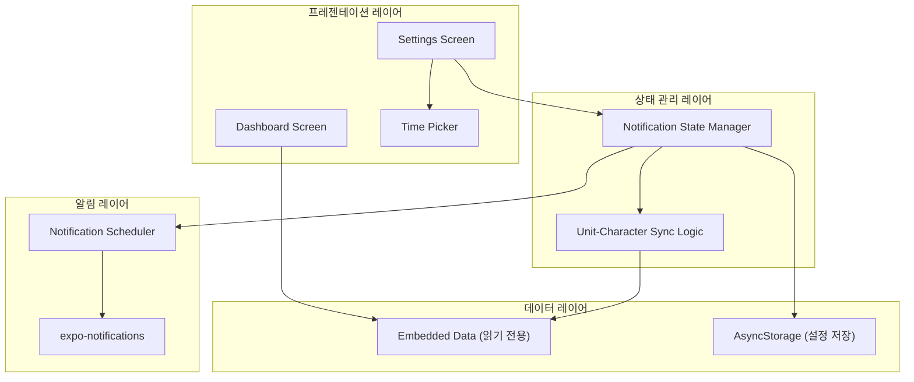
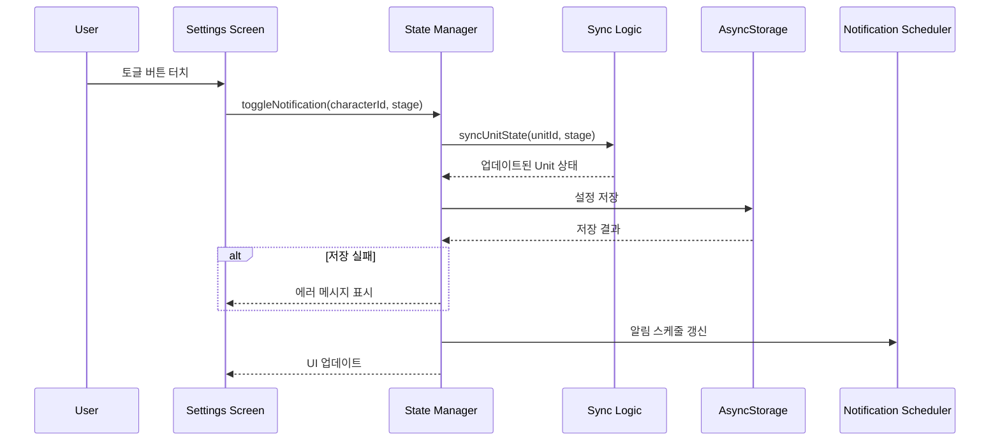
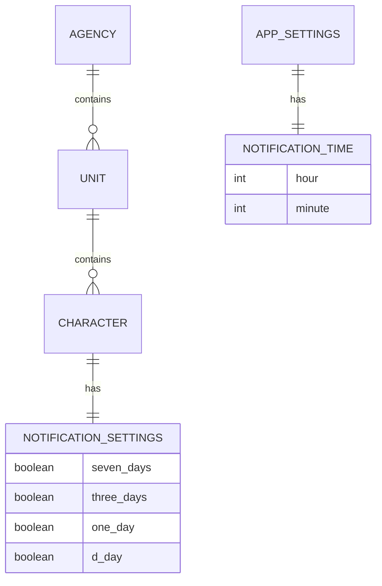

# 설계 문서: 캐릭터 생일 알림 (Character Birthday Notification)

## Overview

캐릭터 생일 알림 앱은 61명의 가상 캐릭터 생일을 관리하고, 사용자 설정에 따라 로컬 푸시 알림을 제공하는 크로스 플랫폼 모바일 애플리케이션이다.

### 기술 스택 선정

**프레임워크: React Native + Expo**

크로스 플랫폼 프레임워크로 React Native(Expo 관리형 워크플로)를 선정한다.

선정 근거:
- 단일 코드베이스로 Android/iOS 동시 지원 (요구사항 12 충족)
- Expo SDK가 로컬 알림 스케줄링(`expo-notifications`), 로컬 저장소(`@react-native-async-storage/async-storage`) 등 핵심 기능을 내장 모듈로 제공
- JavaScript/TypeScript 기반으로 유지보수 용이성 확보
- OTA(Over-The-Air) 업데이트로 앱스토어 심사 없이 빠른 배포 가능
- 활발한 커뮤니티와 풍부한 생태계

**핵심 라이브러리:**
| 라이브러리 | 용도 |
|---|---|
| `expo-notifications` | 로컬 푸시 알림 스케줄링 및 관리 |
| `@react-native-async-storage/async-storage` | 알림 설정 영구 저장 (Local Storage) |
| `expo-router` | 파일 기반 네비게이션 (Dashboard ↔ Settings) |
| `TypeScript` | 타입 안전성 확보 |

### 핵심 설계 원칙

1. **오프라인 퍼스트**: 서버 없이 모든 기능이 기기 내에서 동작
2. **내장 데이터 불변성**: 캐릭터/소속사/유닛 데이터는 읽기 전용
3. **즉시 반영**: 설정 변경 시 UI, 저장소, 알림 스케줄이 동기적으로 갱신
4. **계층적 상태 관리**: Unit ↔ Character 간 양방향 상태 동기화

## Architecture

### 전체 아키텍처



### 레이어 설명

1. **프레젠테이션 레이어**: Dashboard와 Settings 화면. 사용자 인터랙션 처리 및 시각적 피드백 제공
2. **상태 관리 레이어**: 알림 토글 상태 관리 및 Unit-Character 간 동기화 로직 처리
3. **데이터 레이어**: 내장 캐릭터 데이터(불변)와 사용자 설정 데이터(AsyncStorage) 관리
4. **알림 레이어**: expo-notifications를 통한 로컬 알림 스케줄링 및 취소

### 데이터 흐름



## Components and Interfaces

### 1. EmbeddedData 모듈

캐릭터, 소속사, 유닛의 정적 데이터를 제공하는 읽기 전용 모듈.

```typescript
// data/characters.ts
interface Character {
  id: string;
  name: string;
  birthday: { month: number; day: number }; // 년도 없음, 월/일만 구성
  agencyId: string;
  unitId: string;
}

interface Unit {
  id: string;
  name: string;
  agencyId: string;
  characterIds: string[];
}

interface Agency {
  id: string;
  name: string;
  unitIds: string[];
}

// 내보내기 함수
function getCharacters(): Character[];
function getUnits(): Unit[];
function getAgencies(): Agency[];
function getCharactersByUnit(unitId: string): Character[];
function getCharactersByMonth(month: number): Character[];
```

### 2. NotificationSettingsManager

알림 설정 상태를 관리하고 AsyncStorage와 동기화하는 핵심 모듈.

```typescript
// services/NotificationSettingsManager.ts
type NotificationStage = '7days' | '3days' | '1day' | 'dday';

interface CharacterNotificationSettings {
  [characterId: string]: {
    [stage in NotificationStage]: boolean;
  };
}

interface AppSettings {
  characterNotifications: CharacterNotificationSettings;
  notificationTime: { hour: number; minute: number }; // 기본값: { hour: 9, minute: 0 }
  isInitialized: boolean;
}

// 공개 인터페이스
function loadSettings(): Promise<AppSettings>;
function saveSettings(settings: AppSettings): Promise<void>;
function initializeDefaultSettings(): AppSettings;
function toggleCharacterStage(
  settings: AppSettings,
  characterId: string,
  stage: NotificationStage
): AppSettings;
function toggleUnitStage(
  settings: AppSettings,
  unitId: string,
  stage: NotificationStage,
  value: boolean
): AppSettings;
function getUnitStageState(
  settings: AppSettings,
  unitId: string,
  stage: NotificationStage
): boolean;
function setNotificationTime(
  settings: AppSettings,
  hour: number,
  minute: number
): AppSettings;
```

### 3. UnitCharacterSyncLogic

Unit 토글과 Character 토글 간의 양방향 동기화 로직을 담당하는 순수 함수 모듈.

```typescript
// logic/syncLogic.ts

/**
 * Unit 토글 변경 시: 하위 모든 Character의 동일 stage를 일괄 변경
 */
function applyUnitToggle(
  settings: CharacterNotificationSettings,
  unitId: string,
  stage: NotificationStage,
  value: boolean
): CharacterNotificationSettings;

/**
 * Character 토글 변경 후: 해당 Unit의 stage 상태를 재계산
 * - 모든 Character가 On → Unit On
 * - 하나라도 불일치 → Unit Off (다른 Character 상태는 유지)
 */
function computeUnitStageState(
  settings: CharacterNotificationSettings,
  unitId: string,
  stage: NotificationStage
): boolean;
```

### 4. NotificationScheduler

expo-notifications를 래핑하여 알림 스케줄링을 관리하는 모듈.

```typescript
// services/NotificationScheduler.ts

/**
 * 특정 캐릭터의 특정 stage 알림을 스케줄링
 */
function scheduleCharacterNotification(
  character: Character,
  stage: NotificationStage,
  notificationTime: { hour: number; minute: number }
): Promise<string>; // notification identifier 반환

/**
 * 특정 캐릭터의 특정 stage 알림을 취소
 */
function cancelCharacterNotification(
  characterId: string,
  stage: NotificationStage
): Promise<void>;

/**
 * 월간 일괄 알림 스케줄링 (매월 1일)
 */
function scheduleMonthlySummary(
  notificationTime: { hour: number; minute: number }
): Promise<string>;

/**
 * 모든 알림을 재스케줄링 (시간 변경 시)
 */
function rescheduleAllNotifications(
  settings: AppSettings
): Promise<void>;

/**
 * 생일 기준 알림 날짜 계산
 */
function calculateNotificationDate(
  birthday: { month: number; day: number },
  stage: NotificationStage,
  year: number
): Date;
```

### 5. 화면 컴포넌트

```typescript
// screens/DashboardScreen.tsx
// - 현재 월 생일 캐릭터 목록 표시
// - 생일 캐릭터가 없을 경우 안내 메시지 표시

// screens/SettingsScreen.tsx
// - Agency > Unit > Character 계층 구조 표시
// - Unit/Character별 4단계 토글 버튼
// - 알림 시간 설정 (TimePicker)

// components/NotificationToggleButton.tsx
// - On: 브랜드 컬러 / Off: 회색
// - 터치 시 즉시 색상 전환
interface ToggleButtonProps {
  isOn: boolean;
  label: string; // '7', '3', '1', 'D'
  onPress: () => void;
}
```

## Data Models

### 내장 데이터 구조 (Embedded, 읽기 전용)

```typescript
// 61명의 캐릭터 데이터 예시 구조
const CHARACTERS: Character[] = [
  {
    id: "char_001",
    name: "캐릭터이름",
    birthday: { month: 3, day: 15 }, // 년도 없음, 매년 반복
    agencyId: "agency_001",
    unitId: "unit_001"
  },
  // ... 총 61명
];

const UNITS: Unit[] = [
  {
    id: "unit_001",
    name: "유닛이름",
    agencyId: "agency_001",
    characterIds: ["char_001", "char_002", ...]
  },
  // ...
];

const AGENCIES: Agency[] = [
  {
    id: "agency_001",
    name: "소속사이름",
    unitIds: ["unit_001", "unit_002"]
  },
  // ...
];
```

### 사용자 설정 데이터 (AsyncStorage 저장)

```typescript
// AsyncStorage에 저장되는 설정 데이터 스키마
interface PersistedSettings {
  version: 1;
  characterNotifications: {
    [characterId: string]: {
      '7days': boolean;
      '3days': boolean;
      '1day': boolean;
      'dday': boolean;
    };
  };
  notificationTime: {
    hour: number;   // 0-23
    minute: number; // 0-59
  };
  isInitialized: boolean;
}

// 기본값 (최초 설치 시)
const DEFAULT_SETTINGS: PersistedSettings = {
  version: 1,
  characterNotifications: {
    // 모든 캐릭터에 대해:
    // '7days': false, '3days': false, '1day': false, 'dday': true
  },
  notificationTime: { hour: 9, minute: 0 },
  isInitialized: true
};
```

### 알림 식별자 매핑

```typescript
// 알림 ID 생성 규칙
// 개별 알림: `${characterId}_${stage}_${year}`
// 월간 알림: `monthly_summary_${year}_${month}`

interface ScheduledNotificationMap {
  [notificationKey: string]: string; // key → expo notification identifier
}
```

### 상태 관계 다이어그램



## Correctness Properties

*속성(Property)은 시스템의 모든 유효한 실행에서 참이어야 하는 특성 또는 동작이다. 본질적으로 시스템이 무엇을 해야 하는지에 대한 형식적 진술이며, 사람이 읽을 수 있는 명세와 기계가 검증할 수 있는 정확성 보장 사이의 다리 역할을 한다.*

### Property 1: 내장 데이터 무결성

*For any* Character in Embedded_Data, 해당 캐릭터는 유효한 이름(빈 문자열이 아닌), 유효한 생일(month: 1-12, day: 1-31, 년도 없이 월/일만 구성), 유효한 agencyId, 유효한 unitId를 가져야 하며, 해당 unitId의 Unit은 해당 캐릭터를 characterIds에 포함하고, 해당 Unit의 agencyId는 캐릭터의 agencyId와 일치해야 한다.

**Validates: Requirements 1.2, 1.3, 1.6**

### Property 2: 월별 캐릭터 필터링 정확성

*For any* 월(1-12)에 대해, `getCharactersByMonth(month)` 함수가 반환하는 모든 캐릭터의 birthday.month는 해당 월과 일치해야 하며, Embedded_Data에서 해당 월 생일인 캐릭터 중 누락된 것이 없어야 한다.

**Validates: Requirements 2.1, 8.1**

### Property 3: 월간 알림 메시지 완전성

*For any* 캐릭터 목록에 대해, 월간 요약 알림 메시지를 생성하면 해당 메시지에는 목록 내 모든 캐릭터의 이름과 생일 날짜가 포함되어야 한다.

**Validates: Requirements 2.3**

### Property 4: 기본 설정 초기화 정확성

*For any* 캐릭터 목록에 대해, `initializeDefaultSettings`를 실행하면 모든 캐릭터의 'dday' stage는 true이고, '7days', '3days', '1day' stage는 false이며, 정확히 4개의 stage 토글이 존재해야 한다.

**Validates: Requirements 3.1, 11.1, 11.2**

### Property 5: Unit 일괄 토글 전파

*For any* Unit, *for any* NotificationStage, *for any* boolean 값(On/Off)에 대해, `applyUnitToggle(settings, unitId, stage, value)`를 실행하면 해당 Unit에 소속된 모든 Character의 해당 stage 토글이 value와 동일해야 한다.

**Validates: Requirements 5.1, 5.2**

### Property 6: Unit 상태는 하위 Character 일치 여부를 반영

*For any* Unit과 *for any* NotificationStage에 대해, `computeUnitStageState(settings, unitId, stage)`는 해당 Unit 내 모든 Character의 해당 stage가 On일 때만 true를 반환하고, 하나라도 다르면 false를 반환해야 한다.

**Validates: Requirements 6.1, 6.3**

### Property 7: 개별 토글 변경 시 다른 캐릭터 상태 보존

*For any* Unit 내에서 특정 Character의 특정 stage 토글을 변경할 때, 해당 Unit 내 다른 모든 Character의 모든 stage 토글 값은 변경 전과 동일하게 유지되어야 한다.

**Validates: Requirements 6.2**

### Property 8: 설정 저장/복원 라운드 트립

*For any* 유효한 AppSettings 객체에 대해, `saveSettings(settings)` 후 `loadSettings()`를 실행하면 원래 settings와 동일한 객체가 반환되어야 한다.

**Validates: Requirements 7.3**

### Property 9: 알림 스케줄은 토글 상태를 반영

*For any* Character와 *for any* NotificationStage에 대해, 해당 stage가 On이면 알림이 스케줄되어야 하고, Off이면 알림이 스케줄되지 않아야 한다.

**Validates: Requirements 3.2, 3.3**

### Property 10: 알림 날짜 계산 시 설정 시간 적용

*For any* 유효한 생일(month/day), *for any* NotificationStage, *for any* notificationTime(hour: 0-23, minute: 0-59)에 대해, `calculateNotificationDate`가 반환하는 Date의 시간(hour)과 분(minute)은 notificationTime과 일치해야 하며, 날짜는 생일로부터 stage에 해당하는 일수만큼 이전이어야 한다.

**Validates: Requirements 10.2**

## Error Handling

### 저장 실패 처리
- AsyncStorage 저장 실패 시 사용자에게 토스트 메시지로 "저장에 실패했습니다. 다시 시도해주세요." 표시
- 실패한 설정 변경은 메모리 상태에서 롤백하여 UI와 저장소 간 불일치 방지
- 재시도 로직: 최대 2회 자동 재시도 후 실패 시 사용자에게 알림

### 알림 권한 미허용
- 앱 최초 실행 시 알림 권한 요청
- 권한 거부 시 Settings 화면에 "알림 권한이 필요합니다" 안내 배너 표시
- 시스템 설정으로 이동하는 링크 제공

### 설정 데이터 손상
- `loadSettings()` 시 JSON 파싱 실패 또는 스키마 불일치 감지 시 기본값으로 초기화
- 데이터 마이그레이션: `version` 필드를 통해 향후 스키마 변경 시 자동 마이그레이션 지원

### 알림 스케줄링 실패
- `expo-notifications` API 호출 실패 시 에러 로깅 후 다음 앱 실행 시 재스케줄링 시도
- 스케줄링 실패가 사용자 설정 변경을 차단하지 않도록 비동기 처리

### 날짜 경계 처리
- 생일이 2월 29일인 캐릭터: 윤년이 아닌 해에는 2월 28일로 대체 처리
- 연말/연초 경계: 1월 생일의 7일 전 알림이 전년도 12월에 스케줄되도록 처리

## Testing Strategy

### Property-Based Testing (속성 기반 테스트)

**라이브러리**: `fast-check` (TypeScript/JavaScript용 PBT 라이브러리)

각 Correctness Property에 대해 하나의 property-based test를 작성하며, 최소 100회 반복 실행한다.

**대상 모듈 및 속성 매핑:**

| 속성 | 대상 함수 | 생성기 |
|---|---|---|
| Property 1 | Embedded Data 검증 | 내장 데이터 전수 검사 |
| Property 2 | `getCharactersByMonth` | 임의의 월(1-12) |
| Property 3 | 월간 알림 메시지 생성 함수 | 임의의 캐릭터 목록 |
| Property 4 | `initializeDefaultSettings` | 임의의 캐릭터 ID 목록 |
| Property 5 | `applyUnitToggle` | 임의의 설정 상태, unitId, stage, boolean |
| Property 6 | `computeUnitStageState` | 임의의 설정 상태, unitId, stage |
| Property 7 | `toggleCharacterStage` | 임의의 설정 상태, characterId, stage |
| Property 8 | `saveSettings` / `loadSettings` | 임의의 AppSettings 객체 |
| Property 9 | 알림 스케줄링 로직 | 임의의 캐릭터, stage, 토글 상태 |
| Property 10 | `calculateNotificationDate` | 임의의 생일, stage, 시간 |

**태그 형식**: `Feature: character-birthday-notification, Property {N}: {property_text}`

### Unit Testing (단위 테스트)

**라이브러리**: Jest (Expo 기본 테스트 러너)

- 기본 알림 시간 09:00 확인 (요구사항 11.3)
- 저장 실패 시 에러 메시지 표시 (요구사항 7.2)
- 빈 월 대시보드 안내 메시지 (요구사항 8.3)
- 생일 없는 월 알림 미전송 (요구사항 2.2)
- UI 컴포넌트 렌더링 검증 (요구사항 4.1-4.4, 9.1-9.3)

### Integration Testing (통합 테스트)

- AsyncStorage 저장/복원 실제 동작 검증 (요구사항 7.1, 10.4)
- expo-notifications 스케줄링 API 호출 검증
- Android/iOS 플랫폼별 E2E 테스트 (요구사항 12.1-12.3)
